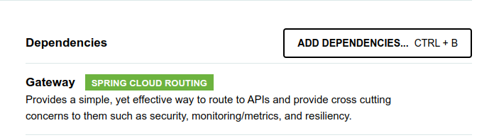
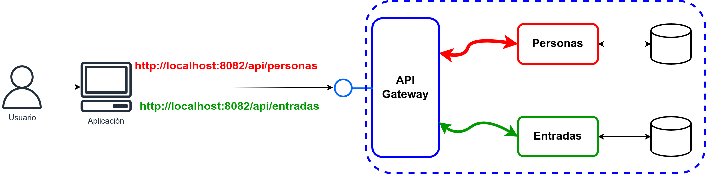

# Apunte 16: API Gateway

## Fundamentos

Es importante tener presente que si se decidió desarrollar el backend con una arquitectura de microservicios, cada uno de estos servicios se despliega para ejecutarse como un proceso separado y que para comunicarse con ellos el cliente debe conocer los detalles de conexión de cada uno de estos servicios. Si se considera el caso más frecuente, donde los servicios brindan una API sobre HTTP, esto significa que el cliente debe conocer la IP y el puerto correspondiente a la API de cada microservicio. Este esquema puede ser manejable si son pocos microservicios, pero es una verdadera complicación cuando esta cantidad crece.

Adicionalmente a lo ya descripto, la estrategia de realizar una conexión directa entre el cliente y cada uno de los microservicios presenta una serie de inconvenientes  y desafíos adicionales, entre ellos:

- *Acoplamiento*

El hecho de realizar una conexión directa entre el cliente y cada microservicio implica que el cliente conoce cuál es la estructura interna del backend, algo que no es recomendable. Se espera que el cliente se conecte a una API unificada y que los detalles de implementación internos del backend no sean expuestos al cliente.

También debe considerarse que, si la conexión es directa hacia los microservicios, los cambios en la interfaz de los mismos afectarán al cliente. Podría pasar que una interfaz se modifique, o que se decida (algo no tan infrecuente) separar las funcionalidades que antes estaban en un microservicio en más de uno, y también lo contrario: unificar en un microservicio las funcionalidades de maś de uno de ellos.

- *Aspectos que atraviesan toda la aplicación*

Existen algunos aspectos, como autenticación, autorización, captura de logs y trazas, etc., que deben ser aplicados en todos los microservicios. Un caso típico tiene que ver con la seguridad. A menos que se estuviera tratando de datos o acciones no protegidas, para que un microservicio responda a una petición, debe tener dos garantías básicas:

1) Que quien realiza la petición sea quién dice ser (Autenticación)
2) Que quien realiza la petición tenga permisos para realizar la acción que pretende (Autorización).

Si cada microservicio es un proceso separado y, a su vez, los clientes se conectan directamente con ellos, entonces cada microservicio debería encargarse de cada uno de los aspectos mencionados. Esto significa programar (o incorporar) en el código de cada microservicio el manejo, por ejemplo, de la autorización y la autenticación. Se podría pensar que no es algo tan problemático, en definitiva se puede hacer una librería compartida e incorporarlo en todos los servicios y problema resuelto. Lamentablemente no es tan simple: si hubiera una actualización que realizar sobre esa librería común, tendrían que re-compilarse/re-empaquetarse y actualizarse todos los servicios; por otro lado, ¿qué pasa si no todos los servicios están desarrollados en el mismo lenguaje?. Otro aspecto negativo de esta estrategia es que suele haber distintos equipos para los distintos microservicios y podría pasar que un equipo se olvidara de incorporar, por ejemplo, el aspecto de seguridad a su microservicio; o bien, el equipo podría realizar su propia implementación de las políticas de seguridad que no sea consistente con el resto de los servicios.

- *Posibilidad de tener protocolos no *web-friendly**

Nada obliga a que un microservicio tenga que exponer su API mediante HTTP (y, por supuesto, nada obliga a utilizar un estilo REST ni el formato JSON). Por distintos motivos podría querer diseñarse un microservicio cuya interfaz se brinde mediante otro protocolo, por ejemplo para soportar plataformas de streaming o colas de mensajería, entre algunas opciones.

Si este fuera el caso y se estuviera utilizando algún protocolo que no es *web-friendly*, el cliente tendría que lidiar con la complejidad de manejar esta comunicación. En principio esto no parece muy preocupante, pero hay que considerar que las tecnologías más típicas de desarrollo para los clientes del backend tienen incorporadas todas las capacidades para realizar invocaciones de estilo REST, pero no suelen tener integradas capacidades de comunicación con otros protocolos (como podría ser AMPQ, por ejemplo).

- *Mayor superficie de exposición*

En relación a la seguridad, hay que tener en cuenta que cuantos más servicios estén publicados al exterior, mayor será la "superficie" de exposición y por lo tanto, una mayor cantidad de puntos por donde se podría recibir un ataque.

## Introducción al API Gateway

Por todo lo expresado anteriormente, queda claro que la comunicación directa desde los clientes hacia los microservicios presenta una serie de inconvenientes y desafíos que quisieran resolverse. Una opción posible es implementar un *API Gateway*, este componente de software actúa como una fachada centralizando las peticiones de los clientes y sirviendo para los mismos una interfaz unificada. Implementando este gateway, que se ubica entre los clientes y los microservicios, a los clientes se les brinda un único punto para conectarse (ya no pueden conectarse más a los microservicios directamente, sino únicamente mediante el API Gateway).

La interacción entre el cliente y los microservicios ocurrirá en la siguiente secuencia:

1. El cliente (una aplicación web, por ejemplo) envía la petición a la URL del API Gateway
2. El API Gateway analiza la petición recibida de acuerdo a su configuración. En base a su configuración decidirá si debe aplicarse alguna acción sobre la petición o no y procederá a *rutear* la petición hacia la URL del microservicio correspondiente.
3. El API Gateway recibe la respuesta del microservicio y la analiza de acuerdo a su configuración. Decide si debe realizar alguna acción sobre la respuesta (por ejemplo, agregar algún header) y retorna la respuesta al cliente.

Queda claro, entonces, que el API Gateway trabaja como un intermediario que presenta una fachada uniforme para los clientes y resuelve hacia que microservicio(s) debe enviarse la petición sin necesidad de que el cliente conozca la estructura interna del backend.

Pero, además de realizar el ruteo y presentar una interfaz uniforme, ¿qué más puede hacer el API Gateway?, ¿Qué otro inconveniente, de los mencionados, permite resolver?. En la secuencia de interacción previamente descrita se puede leer que el gateway *decide, en base a su configuración, si hay alguna acción que aplicar sobre la petición*, una acción posible sobre la petición podría ser, por ejemplo, revisar si  la misma contiene un header de autorización e invocar al servicio de autorización antes de rutear la petición al microservicio de destino. Otro ejemplo podría ser revisar la dirección IP del cliente para determinar si la misma viene de un país habilitado para utilizar los servicios del backend. También pueden recolectarse aquí logs y trazas, convertir algún protocolo o implementar un caché de peticiones. En síntesis, al ser un punto que centraliza todas las peticiones de los clientes, aquellos aspectos y políticas que atraviesan a los distintos microservicios pueden ser aplicados en este componente.

### Responsabilidades típicas

#### Ruteo de peticiones

Se debe recordar que el API Gateway es el punto de entrada de la aplicación y, por lo tanto, su responsabilidad principal es poder "rutear" o redirigir las peticiones que recibe hacia el microservicio correcto. Para poder realizar su tarea, el gateway debe tener configurado un "mapa de rutas" que explique cuáles son las rutas que debe seguir para redireccionar las peticiones. Para entender que significa esta configuración es de utilidad revisar el siguiente ejemplo:

| URL a la que accede el cliente | URL a la que se reenvía la petición |
| :-----------------------------: | :--------------------------: |
| https://url_api_gw/api/v1/personas/123 | http://url_servicio_personas:8080/v1/personas/123
| https://url_api_gw/api/v1/articulos/7588 | http://url_servicio_articulos:8081/v1/articulos/7588

El cliente tiene un único punto de acceso, que en el ejemplo es *https://url_api_gw/api/v1* y el gateway definirá en base a su configuración a qué microservicio reenviar la petición. En el ejemplo, las peticiones a */personas* se reenvían al microservicio de personas y las peticiones a */articulos* se reenvían al microservicio de artículos. Lo que responda el microservicio es lo que responderá el GW a su cliente.

#### Ruteo dinámico

Hay situaciones donde se requiere realizar un ruteo más inteligente que únicamente asociar una URL con otra. Podría pensarse, por ejemplo, en que si la petición contiene un cierto header entonces realizar una redirección particular. En estos casos se dice que el ruteo es dinámico, en contraposición al ruteo estático ejemplificado anteriormente.

#### Agregación / Composición

Otra de las responsabilidades principales de un API Gateway es liberar al cliente de la necesidad de realizar múltiples invocaciones para obtener datos relacionados entre sí.

Pensando en la aplicación web de una clínica que brinda de manera on-line los resultados de los estudios de sus pacientes, esta podría requerir mostrar (en la misma página) los datos del paciente y el listado de los resultados disponibles. En este caso, si los datos del paciente son administrados por un microservicio y los resultados de los estudios por otro, la aplicación web debe realizar dos llamadas para poder mostrar la información requerida.

En base al ejemplo anterior, ¿cómo podría hacer el API Gateway para evitar que el cliente requiera dos llamadas al backend?. La respuesta es que sea el gateway quién reciba una única petición y se encargue de realizar las dos peticiones a los servicios correspondientes, para luego agregar los resultados en una única respuesta para su cliente.

Cabe preguntarse cuál es el beneficio de esta solución si, en definitiva, igual se hacen dos llamadas a los dos microservicios. Una ventaja de esta solución (que no es menor), es que el API Gateway se encuentra en la misma infraestructura que los microservicios y conectado a los mismos mediante una red interna de alta velocidad, a diferencia del cliente del backend (por ejemplo, un web browser) que se comunica con el mismo, típicamente, a través de internet donde las demoras son mayores.

#### Autenticación / Autorización

Se estudió en los apuntes 16 y 17 al respecto de la seguridad en el Backend. Siendo el *API Gateway* un punto de acceso a los distintos microservicios, es posible configurar el gateway para que las peticiones se ruteen únicamente si se cumple con los requisitos de autenticación y autorización.

Si, por ejemplo, se decidió OAuth2 o algún tipo de autorización basada en tokens, el *API Gateway* podría actuar como primer punto de control, revisar que el encabezado correcto esté presente en las peticiones y realizar la validación del token.

#### Rate limiting

Significa limitar la tasa de peticiones permitida para los clientes del API Gateway (por ejemplo, no se permiten más de 1000 peticiones/segundo). Si bien esto pareciera contrario a la expectativa de que el backend responda a tantas peticiones como sea posible, se debe tener en cuenta que hay situaciones donde este límite puede ser deseable, por ejemplo:

- *Protegerse de ataques de denegación de servicio*
  
Este tipo de ataques consiste en enviar la mayor cantidad de peticiones posibles hacia el backend de manera de agotar sus recursos e impedir que brinde servicio a los clientes del mismo. Limitar la cantidad de peticiones que se aceptan es favorable en este contexto.

- *Evitar problemas de performance*

Independientemente de que se haya elegido una arquitectura basada en microservicios o no, se debe tener en cuenta que los servicios que conforman el backend están desplegados sobre una infraestructura que cuenta con ciertas capacidades. Cuanto mayor sea la cantidad de peticiones que el backend deba atender en un momento dado, mayores serán los recursos a utilizar y, si estos resultan excesivos, la performance general disminuirá: cada petición demorará más tiempo en ser respondida (en el mejor de los casos).

Si no existe un límite en la tasa de peticiones que puede realizar un cliente podría pasar que uno de los clientes invoque los servicios del backend a una tasa muy elevada impactando en la respuesta del backend a los demás clientes.

Si bien este punto parece similar al anterior, debe quedar claro que el hecho de que un cliente realice peticiones a una tasa elevada no significa que esté tratando de realizar un ataque sobre el backend.

#### Caché

Algo que debe tenerse en cuenta es que el backend (compuesto por microservicios, o no) no es una pieza de software aislada que no tiene relación con ningún otro componente. Por el contrario, lo más común es que exista un front-end (o varios) que se comunican con el backend para conformar una aplicación y brindar funcionalidades al usuario. Por este motivo, cuanto más demore el backend en responder a las peticiones peor será la experiencia del usuario final de la aplicación y esto es algo que debe evitarse.

Una estrategia es utilizar lo que se conoce como un *caché*. Un caché es una copia de los datos que se acceden más frecuentemente, realizada en una memoria de (muy) rápido acceso.

Un ejemplo que puede resultar de utilidad para entender este concepto podría ser el de un API que brinde información sobre las estaciones de servicio que se encuentran en una ciudad (Nombre, Ubicación, bandera, combustibles disponibles, etc.). Sin un caché, cada vez que se le consulta al API sobre una estación, los datos deben ir a buscarse (probablemente) a la base de datos, lo que es una operación costosa en tiempo y recursos. Si, en cambio, existiera un caché con los datos de las estaciones, ante la primera consulta de una estación, los datos se buscarían en la base de datos (pagando el costo en tiempo y recursos) y se dejaría una copia de los mismos en memoria RAM, y las próximas veces que se consulten los datos de la misma estación, los mismos se buscarían directamente de la memoria RAM cuyo acceso es *mucho* más rápido que el acceso a una base de datos.

Una responsabilidad típica de un API Gateway es la de realizar un caché con los datos respondidos por ciertas APIs. En general, lo que hará el gateway es revisar si respondió previamente a una petición que haya sido realizada a una url y con exactamente los mismos parámetros y responderá directamente los datos del caché en lugar de invocar al microservicio correspondiente.

Debe quedar claro que esta explicación no es exhaustiva en lo más mínimo, sino una explicación muy general sobre el funcionamiento de un caché. Para implementar correctamente un caché hay muchos aspectos a considerar, por ejemplo: ¿qué datos van a ser "cacheados"?, ¿cuál es la frecuencia de actualización de esos datos?, ¿cómo se actualiza el caché?, ¿se utilizará algún producto para implementar el caché (redis, memcached, infinispan, etc.)?, ¿cuánta memoria ocupará este caché?.

#### Recolección de Métricas

Para poder monitorear correctamente la solución del backend es crucial contar con métricas que puedan brindar una idea de su comportamiento. Estas métricas pueden ser muy variadas (y no es el objetivo de estas notas una explicación muy detallada) pero algunos ejemplos incluyen: Cantidad de peticiones, Tiempos de respuesta, *Caché misses", Status HTTP devueltos, etc.

Siendo el gateway el punto de acceso de los clientes al backend, es razonable que esta recolección se realice en este punto y no en cada uno de los microservicios que componen al backend.

### Algunas posibles desventajas

- Posible introducción de un SPoF
- Es otro componente a programar/configurar/mantener
- Introduce mayores tiempos de repuesta
- Si su desarrollo/configuración depende de un único equipo, puede introducir cuellos de botella en el desarrollo del backend como conjunto
  
## Implementación del API Gateway

En línea con el resto de los apuntes de la materia, en este se utilizará SpringBoot para la implementación del API Gateway. Como es frecuente, dentro del ecosistema de Spring existe un proyecto que simplifica la construcción de un API Gateway. Este proyecto se llama *Spring Cloud Gateway*.

### Creación del proyecto

Si se utiliza *Spring Initializer*, se debe buscar la dependencia **Gateway**, como se muestra a continuación:



La dependencia que agregará initializer será:

```xml
<dependency>
    <groupId>org.springframework.cloud</groupId>
    <artifactId>spring-cloud-starter-gateway</artifactId>
</dependency>
```

### Configuración

Al igual que en otros proyectos que utilizan SpringBoot, *Spring Cloud Gateway* tiene autoconfiguración (con configuraciones por defecto) y esta configuración puede personalizarse en base al archivo de configuración o proveyendo una nueva implementación de un bean en particular. En este apunte, esta configuración se hará mediante la creación de un bean.

#### Ruteo

Para la configuración del ruteo que va a realizar el *API Gateaway* el bean a proveer es una instancia que implemente *RouteLocator*. *Spring* inyectará (si así se solicita) un objeto *builder* para hacer esta tarea más sencilla. La clase de configuración puede iniciar de esta manera:

```java
@Configuration
public class GWConfig {

    @Bean
    public RouteLocator configurarRutas(RouteLocatorBuilder builder){
        return builder.routes().build();
    }

}
```

Tendría poco valor construir un objeto *RouteLocator* sin rutas, por lo que será necesario agregar definiciones de rutas a este objeto. Para esto debe comprenderse que el método *routes()* de *RouteLocatorBuilder* devuelve un objeto builder también; este builder provee métodos para construír rutas (y estos métodos también devuelven al builder), haciendo que las llamdas puedan encadenarse y hacer más compacto y legible el código.

El objeto builder que permite crear una ruta provee los siguientes métodos:

```java
public Builder route(Function<PredicateSpec, Buildable<Route>> fn);
public Builder route(String id, Function<PredicateSpec, Buildable<Route>> fn);
```

Entre ambos métodos la diferencia es que en el segundo, se puede asignar un *id* a la ruta pero, dejando de lado este detalle, se puede ver que para construír una ruta es necesario pasar como argumento una Función (la interfaz funcional *Function*) cuyo parámetro es un *PredicateSpec* y que debe retornar una instancia *Buildable\<Route\>*. No es necesario detenerse en la estructura de estas clases e interfaces, pero sí es útil notar lo siguiente: para crear una ruta se debe especificar un predicado que permita determinar si la ruta debe activarse o no. Una ruta muy simple podría configurarse de la siguiente manera:

```java
@Configuration
public class GWConfig {

    @Bean
    public RouteLocator configurarRutas(RouteLocatorBuilder builder) {
        return builder.routes()
                .route(p -> p
                        .path("/get")
                        .uri("https://postman-echo.com")
                )
                .build();
    }

}

```

***
**Nota:** en https://postman-echo.com se encuentra una serie de endpoints que sirven para realizar pruebas de clientes REST. Simplemente recibe peticiones y devuelve detalles de la misma (como si fuera un eco). De esta manera, se puede revisar si se está realizando correctamente la invocación, si llegan los parámetros, etc.
***

Cuando el GW reciba una peticióin a *http://localhost:8082/get*, la misma se reenviará a *https://postman-echo.com* y lo que responda este último, es lo que responderá el gateway. A continuación se puede ver un ejemplo de esto:

Petición

```bash
curl -v "http://localhost:8082/get?param1=prueba&param2=gateway"
*   Trying 127.0.0.1:8082...
* Connected to localhost (127.0.0.1) port 8082 (#0)
> GET /get?param1=prueba&param2=gateway HTTP/1.1
> Host: localhost:8082
> User-Agent: curl/7.81.0
> Accept: */*

```

Respuesta

```bash
< HTTP/1.1 200 OK
< Date: Fri, 20 Oct 2023 23:04:37 GMT
< Content-Type: application/json; charset=utf-8
< Content-Length: 522
< ETag: W/"20a-qseG9I9t14PBzPl3n1dZsCBgC14"
< set-cookie: sails.sid=s%3A3sdLDoVxPdVfIqlAoRWCr3uVDRgMVcxJ.BsPJGUJNuqUhG9R9fLRL0gZh8PlIlxyyMvlDSi47S6o; Path=/; HttpOnly
< 
{
  "args": {
    "param1": "prueba",
    "param2": "gateway"
  },
  "headers": {
    "x-forwarded-proto": "https",
    "x-forwarded-port": "443",
    "host": "postman-echo.com",
    "x-amzn-trace-id": "Root=1-65330785-79250f6525522e521763f4d3",
    "content-length": "0",
    "user-agent": "curl/7.81.0",
    "accept": "*/*",
    "forwarded": "proto=http;host=\"localhost:8082\";for=\"127.0.0.1:46534\"",
    "x-forwarded-host": "localhost:8082"
  },
  "url": "https://postman-echo.com/get?param1=prueba&param2=gateway"
* Connection #0 to host localhost left intact
}
```

Aunque muy básica, esta primera configuración de ruteo permite ver en acción a una de las principales funcionalidades de un *API Gateway*.

##### Predicados

Los predicados, entonces, definirán si la petición que recibe el *API Gateway* activará o no un ruteo. Si bien el predicado del ejemplo anterior se realizó en base al path de la petición, no es la única posibilidad: Se puede analizar coincidencia con cualquier elemento de la petición HTTP original (el método HTTP, el host al que se envía, headers, etc.).

Algunos métodos disponibles en los predicados de *Spring Cloud Gateway* son:

- **path():** Revisa la coincidencia con el path al que se realizó la petición
- **method():** Revisa la coincidencia del método HTTP invocado
- **host():** Revisa la coincidencia del host al que se realiza la petición
- **before() / after():** Revisa si la petición se hizo antes/después de un cierto momento.
- **query():** Revisa la coincidencia con un parámetro de la url.
- **header():** Revisa la coincidencia con algún encabezado de la petición.

Adicionalmente pueden combinarse entre ellos mediante el uso de **and()**/**or()**, como se muestra a continuación:

```java
@Configuration
public class GWConfig {

    @Bean
    public RouteLocator configurarRutas(RouteLocatorBuilder builder) {
        return builder.routes()
                // Si llega una petición a http://localhost:8082/get, la misma se
                // envía a https://postman-echo.com/get
                .route(p -> p
                        .host("localhost:8082")
                        .and()
                        .path("/get")
                        .and()
                        .before(ZonedDateTime.of(2023, 12, 31, 23, 59, 59, 0, ZoneId.systemDefault()))
                        .uri("https://postman-echo.com")
                )
                .build();
    }

}
```

Aquí, para que la petición sea ruteada, debe suceder que el host sea *localhost:8082*, además el path */get* y finalmente que la petición se realice antes del final del año 2023.

De acuerdo a lo explicado en las primeras secciones, construír la configuración de ruteo permitirá, entre otras cosas, que el *API Gateway* actúe como un único punto de entrada y reenvíe las peticiones al microservicio correcto.

##### Filtros

Los filtros permiten realizar modificaciones sobre la petición que se está reenviando al microservicio, o bien a la respuesta de este último. Si el filtro actúa *antes* de reenviar la petición del *API Gateway* al microservicio, se trata de un *Pre-Filtro*; si, en cambio actúa sobre la respuesta del microservicio (*después* de que se envió la petición al microservicio y *antes* de retornar la respuesta al cliente) se trata de un *Post-Filtro*.

Los filtros son de gran utilidad ya que permiten, por ejemplo, agregar encabezados a la petición y/o a la respuesta. En una arquitectura de microservicios esto puede ser especialmente valioso.

Si bien los filtros se pueden programar, *Spring Cloud Gateway* cuenta con una serie de filtros ya programados para los usos más comunes como: Agregar/Modificar encabezados en las peticiones y en las respuestas, generar redirecciones, modificar la ruta de la petición, setear el código de repuesta HTTP, etc.

Utilizando la clase de configuración, un filtro se puede agregar a una ruta de la siguiente manera:

```java
@Configuration
public class GWConfig {

    @Bean
    public RouteLocator configurarRutas(RouteLocatorBuilder builder) {
        return builder.routes()
                // Si llega una petición a http://localhost:8082/echo, la misma se
                // envía a https://postman-echo.com/get
                .route(p -> p
                        .path("/echo")
                        .filters(f -> f.rewritePath("/echo", "/get"))
                        .uri("https://postman-echo.com")
                )
                .build();
    }

}
```

En este caso, se reemplaza el path original */echo* por */get*. De esta manera, si se invoca al *API Gateway* utilizando *<http://localhost:8082/echo>* la petición se reenviará a *<https://postman-echo.com/get>*.

Desde luego que se pueden agregar tantos filtros como se desee. El código a continuación muestra un ejemplo donde se agregan dos filtros (*RewritePath* y *SetRequestHeader*):

```java
@Configuration
public class GWConfig {

    @Bean
    public RouteLocator configurarRutas(RouteLocatorBuilder builder) {
        return builder.routes()
                // Si llega una petición a http://localhost:8082/echo, la misma se
                // envía a https://postman-echo.com/get
                .route(p -> p
                        .path("/echo")
                        .filters(f -> f
                                .rewritePath("/echo", "/get")
                                .setRequestHeader("User-Agent", "SpringCloudGateway")
                        )
                        .uri("https://postman-echo.com")
                )
                .build();
    }
}
```

### Uniendo las partes

En esta sección se procederá a implementar un *API Gateway* utilizando como ejemplo concreto dos microservicios que se presentaron en el **Apunte 14: Spring Data**, y que se puede encontrar en:

```url
https://labsys.frc.utn.edu.ar/gitlab/backend-app/alumnos/contenido/semana-11.git
```

Bajo la ruta */ejemplos/entradas-kempes*. Se trata de dos microservicios qeu trabajan en el contexto de una aplicación que permite emitir entradas nominadas para eventos que se realizan en el Estadio Kempes. Estos dos microservicios son:

- **entradas**: Servicio que se encarga de la emisión de las entradas
- **personas**: Servicio que maneja los datos de las personas registradas en el sistema

En la implementación de esta sección, se desarrollará un *API Gateway* que hará de punto de entrada para la aplicación. A partir de este punto de entrada y, en base al path al que se desee acceder, ruteará las peticiones hacia uno u otro microservicio. Adicionalmente, se implementará el control de autorización para que los endpoints puedan ser accedidos únicamente por quienes están autorizados para hacerlo.

Los valores de configuración para esta implementación serán los siguientes:

Para el proyecto *API Gateway*:

- **apunte-api-gw-kempes.url-microservicio-personas** = http://localhost:8083
- **apunte-api-gw-kempes.url-microservicio-entradas** = http://localhost:8084

La estructura será la siguiente:



#### Ejecución de los microservicios

Se mencionó que hay dos microservicios, el de **entradas** y el de **personas**. Estos dos microservicios son autónomos y cada uno de ellos es un programa/proceso distinto. En esta implementación, se asume que los servicios están configurados de la siguiente manera:

- **Personas:** Escucha en el puerto 8083 y brinda los siguientes endpoints:
  - **GET** */api/personas*. Devuelve todas las personas registradas
  - **GET** */api/personas/{id}*. Devuelve una persona buscada por ID
  - **GET** */api/personas/nombre/{nombre}*. Busca personas por nombre.
  - **POST** */api/personas*. Crea una nueva persona
  - **PUT** */api/personas/{id}*. Actualiza una persona
  - **DELETE** */api/personas/{id}*. Elimina a una persona
- **Entradas:** Escucha en el puerto 8084 y brinda los siguientes endpoints:
  - **POST** /api/entradas. Crea una nueva entrada.

Para comunicarse con esos servicios, hasta este momento, habría que conocer la uri de dos servicios de manera separada.

#### Configuración del API Gateway

Se deberá crear un proyecto con las características y dependencias estudiadas previamente. Para esto se puede utilizar *Spring Initializer*, y el archivo **pom.xml** de esta implementación podría ser como el siguiente:

```xml
<?xml version="1.0" encoding="UTF-8"?>
<project xmlns="http://maven.apache.org/POM/4.0.0" xmlns:xsi="http://www.w3.org/2001/XMLSchema-instance"
         xsi:schemaLocation="http://maven.apache.org/POM/4.0.0 https://maven.apache.org/xsd/maven-4.0.0.xsd">
    <modelVersion>4.0.0</modelVersion>
    <parent>
        <groupId>org.springframework.boot</groupId>
        <artifactId>spring-boot-starter-parent</artifactId>
        <version>3.1.5</version>
        <relativePath/> <!-- lookup parent from repository -->
    </parent>
    <groupId>ar.edu.utn.bda</groupId>
    <artifactId>apunte-api-gw-kempes</artifactId>
    <version>0.0.1-SNAPSHOT</version>
    <name>API GW Kempes</name>
    <description>Ejemplo de API GW Entradas Kempes</description>
    <properties>
        <java.version>17</java.version>
        <spring-cloud.version>2022.0.4</spring-cloud.version>
    </properties>
    <dependencies>

        <dependency>
            <groupId>org.springframework.cloud</groupId>
            <artifactId>spring-cloud-starter-gateway</artifactId>
        </dependency>

        <dependency>
            <groupId>org.projectlombok</groupId>
            <artifactId>lombok</artifactId>
            <optional>true</optional>
        </dependency>

        <dependency>
            <groupId>org.springframework.boot</groupId>
            <artifactId>spring-boot-starter-test</artifactId>
            <scope>test</scope>
        </dependency>

    </dependencies>
    
    <dependencyManagement>
        <dependencies>
            <dependency>
                <groupId>org.springframework.cloud</groupId>
                <artifactId>spring-cloud-dependencies</artifactId>
                <version>${spring-cloud.version}</version>
                <type>pom</type>
                <scope>import</scope>
            </dependency>
        </dependencies>
    </dependencyManagement>

    <build>
        <plugins>
            <plugin>
                <groupId>org.springframework.boot</groupId>
                <artifactId>spring-boot-maven-plugin</artifactId>
            </plugin>
        </plugins>
    </build>

</project>

```

Luego es necesario crear las configuraciones del gateway como se estudió en la sección anterior. Para el ejemplo de esta aplicación, una configuración probable para las rutas es como la siguiente:

```java
@Configuration
@EnableWebFluxSecurity
public class GWConfig {

    @Bean
    public RouteLocator configurarRutas(RouteLocatorBuilder builder,
                                        @Value("${apunte-api-gw-kempes.url-microservicio-personas}") String uriPersonas,
                                        @Value("${apunte-api-gw-kempes.url-microservicio-entradas}") String uriEntradas) {
        return builder.routes()
                // Ruteo al Microservicio de Personas
                .route(p -> p.path("/api/personas/**").uri(uriPersonas))
                // Ruteo al Microservicio de Entradas
                .route(p -> p.path("/api/entradas/**").uri(uriEntradas))
                .build();

    }
}
```

Esta porción de la configuración genera las rutas necesarias para ambos microservicios. Cuando el gateway reciba una petición a *http://ruta_gateway/api/personas*, la misma se reenviará a *http://ruta_microservicio_personas/api/personas*. En términos concretos de este ejemplo:

| URL a la que accede el cliente | URL a la que se reenvía la petición |
| :-----------------------------: | :--------------------------: |
| **GET** <https://localhost:8082/api/personas/123> | **GET** <http://localhost:8083/personas/123> |
| **POST** <https://localhost:8082/api/personas> | **POST** <http://localhost:8083/personas> |
| **POST** <https://localhost:8082/api/entradas> | **POST** <http://localhost:8084/api/entradas> |

***
**Nota:** Se destaca que para acceder al GW se lo hace conectándose al puerto 8082 y luego el GW puede reenviar esas peticiones a los puertos 8083 y 8084 dependiendo de qué servicio deba accederse. Aquí se ve claramente lo que significa que el GW sea un único punto de entrada para la aplicación.
***

## Apéndice 1: Invocación a un servicio

En muchos casos será necesario que una aplicación (un microservicio, por ejemplo) se comunique con otra y, posiblemente, lo haga mediante una invocación a una API ReST. A continuación se indica como esto puede ser realizado utilizando herramientas de *Spring*. Debe aclararse que la alternativa que se estudiará a continuación no es, de ninguna manera, la única; existen clientes HTTP incluídos en Java desde Java 11 y muchas librerías como *Apache HTTP Client* o, incluso, otros proyectos de *Spring* como *WebFlux*.

### RestTemplate

#### GET

Una de las varias maneras que existen para realizar una petición REST es el uso de la clase **RestTemplate** provista por Spring. Un ejemplo se puede observar a continuación:

```java
public void invocarServicio() {
      // Creación de una instancia de RestTemplate
      try {
          // Creación de la instancia de RequestTemplate
          RestTemplate template = new RestTemplate();
          // Se realiza una petición a http://localhost:8082/api/personas/{id}, indicando que id vale 1 y que la 
          // respuesta de la petición tendrá en su cuerpo a un objeto del tipo Persona. 
          ResponseEntity<Persona> res = template.getForEntity(
                  "http://localhost:8082/api/personas/{id}", Persona.class, 1
          );

          // Se comprueba si el código de repuesta es de la familia 200
          if (res.getStatusCode().is2xxSuccessful()) {
              log.debug("Persona obtenida correctamente: {}", res.getBody());
          } else {
              log.warn("Respuesta no exitosa: {}", res.getStatusCode());
          }
          
      } catch (HttpClientErrorException ex) {
          // La repuesta no es exitosa.
          log.error("Error en la petición", ex);
      }
  }
```

Al analizar el código se puede ver lo siguiente:

- Se construye una instancia de *RestTemplate*
- El método *getForEntity()* permite realizar una petición get esperando una entidad como respuesta (en otras palabras, se espera que la respuesta sea interpretada y devuelva un objeto).
- *getForEntity()* Espera: 1) la ruta donde se hará la petición, que puede incluír variables de path y query parameters; 2) El tipo al que pertenece la respuesta (Persona, en este caso); 3) Opcionalmente los valores de las variables de la uri (el id, en este caso).
- La respuesta no es directamente una persona, sino un objeto del tipo *ResponseEntity\<Persona\>*. Esto permite acceder, por ejemplo, al código de repuesta y otros detalles de la respuesta y, además, al objeto contenido en la misma si existiera.
- En caso de que la repuesta no fuera exitosa, *getForEntity()* arroja una excepción.
- Existe un método llamado *getForObject()* Similar a *getForEntity()* pero devuelve directamente el objeto y no el código de respuesta. En el ejemplo, devolvería una *Persona* y no *RequestEntity\<Persona\>*.

#### POST

También pueden realizarse peticiones **POST**. En este caso se puede enviar una entidad en el body de la petición de la siguiente manera:

```java
public void crearPersona(Persona p) {
    // Creación de una instancia de RestTemplate
    try {
        // Creación de la instancia de RequestTemplate
        RestTemplate template = new RestTemplate();

        // Creación de la entidad a enviar
        HttpEntity<Persona> entity = new HttpEntity<>(p);

        // respuesta de la petición tendrá en su cuerpo a un objeto del tipo Persona.
        ResponseEntity<Persona> res = template.postForEntity(
                "http://localhost:8082/api/personas", entity, Persona.class
        );
    // Se comprueba si el código de repuesta es de la familia 200
        if (res.getStatusCode().is2xxSuccessful()) {
            log.debug("Persona creada correctamente: {}", res.getBody());
        } else {
            log.warn("Respuesta no exitosa: {}", res.getStatusCode());
        }

    } catch (HttpClientErrorException ex) {
        // La repuesta no es exitosa.
        log.error("Error en la petición", ex);
    }
}
```

El método utilizado aquí es *postForEntity()* cuyos parámetros son: 1) La uri a invocar; 2) La entidad que se quiere enviar; 3) El tipo que se espera como respuesta.

Al igual que existía *getForEntity()* y *getForObject()*, con iguales comentarios existe *postForObject()*.

#### PUT/PATCH/DELETE

*RestTemplate* incluye, también, los métodos *put()*, *patchForObject()* y *delete()* que permiten invocar estos métodos HTTP. Un ejemplo se muestra a continuación:

```java
String uri = "http://localhost:8082/api/personas/{id}";
// PUT - Actualizar la persona con ID = 1
template.put(uri, p, 1);
// PATCH - Actualizar la persona con ID = 1 (La petición devuelve una Persona)
template.patchForObject(uri, p, Persona.class,1);
// DELETE - Eliminar a la persona con ID = 1
template.delete(uri, 1);
```
